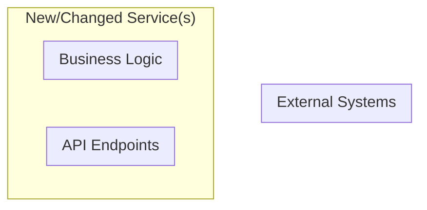
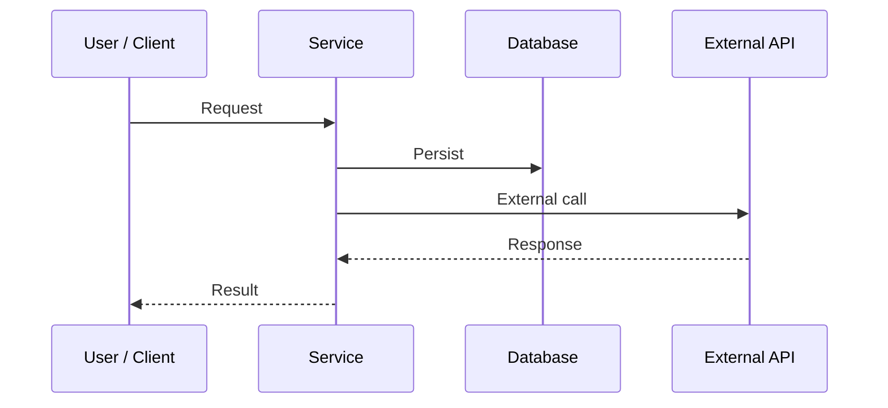

## Document Information

- **Project Name**: [Name]
- **Author(s)**: [Names and roles]
- **Date**: [YYYY-MM-DD]
- **Related PRD**: [Link or "N/A"]
- **Figma**: [Link or "N/A"]
- **Linear Epic**: [Link or "N/A"]
- **Reviewers**: [Names]
- **Status**: [Draft | Under Review | Approved | Implemented]
- **Review Deadline**: [YYYY-MM-DD or "TBD"]

---

## 1. Executive Summary

### 1.1 Problem Statement

[3-5 sentences: what technical problem are we solving, what are we
building, what is the high-level approach.]

### 1.2 Motivation and Context

**Why is this work needed?**

- [Problem or opportunity being addressed.]
- [Current system limitations or pain points.]
- [Business or technical driver.]

**Why now?**

- [What changed that makes this a priority.]
- [What happens if we don't do this.]

---

## 2. Objectives

### 2.1 Technical Objectives

[Specific technical outcomes this work will deliver.]

### 2.2 In Scope

[Systems, components, or capabilities being changed or built.]

### 2.3 Out of Scope

[Explicit exclusions to prevent scope creep.]

---

## 3. Technical Context and Constraints

### 3.1 Current State

- [Existing architecture/systems this touches.]
- [Current limitations or pain points.]
- [Technical debt relevant to this work.]

### 3.2 Dependencies

**External Dependencies**:

| Service | Purpose | SLA / Rate Limits |
| ------- | ------- | ----------------- |
|         |         |                   |

**Internal Dependencies**:

| Service / System | Purpose |
| ---------------- | ------- |
|                  |         |

### 3.3 Constraints and Assumptions

- **Performance requirements**: [Latency, throughput.]
- **Scalability targets**: [Expected load.]
- **Backward compatibility**: [Requirements.]
- **Security/compliance**: [Requirements.]
- **Infrastructure limitations**: [Constraints.]
- **Mobile app version support**: [If applicable.]

---

## 4. Proposed Technical Solution

### 4.1 High-Level Architecture

**System Diagram**:

**Key Components**:

| Component | Responsibility | Tech Stack |
| --------- | -------------- | ---------- |
|           |                |            |

**Data Flow**:

1. [Step 1.]
2. [Step 2, noting sync vs. async.]
3. [Step 3, highlighting external API calls.]

**Feature Flags**:

| Flag Name | Type | Purpose |
| --------- | ---- | ------- |
|           |      |         |

### 4.2 User and System Flows

**Flow 1: [Primary Happy Path]**

**Flow 2: [Error Scenario]**

[What happens when a specific error occurs, including system
behavior, user experience, and recovery.]

### 4.3 Key Design Decisions

**Decision 1: [Topic]**

- **Chosen approach**: [Decision.]
- **Rationale**: [Why.]
- **Trade-off**: [What we give up.]
- **Alternative considered**: [What was rejected and why.]

### 4.4 Detailed Design

#### 4.4.1 Data Model

| Table / Collection | Change | Key Fields | Notes |
| ------------------ | ------ | ---------- | ----- |
|                    |        |            |       |

- **Migration strategy**: [Approach.]
- **Indexes**: [Performance considerations.]
- **Constraints**: [Referential integrity.]
- **Data retention**: [Archival strategy.]

#### 4.4.2 API Design

| Method | Path | Purpose | Auth | Request | Response |
| ------ | ---- | ------- | ---- | ------- | -------- |
|        |      |         |      |         |          |

- **Authentication/authorization**: [Approach.]
- **Versioning**: [Strategy.]

#### 4.4.3 Business Logic

- **Core processing logic**: [Algorithms, rules.]
- **State machines**: [Workflow definitions.]
- **Validation rules**: [Constraints.]
- **Edge cases**: [Error handling.]

#### 4.4.4 Infrastructure

- **Compute**: [Cloud Functions, services, containers.]
- **Storage**: [Databases, caches, file storage.]
- **Async processing**: [Message queues, PubSub.]

---

## 5. Risk Analysis and Mitigation

### 5.1 Risk Assessment

| Risk | Likelihood   | Impact                | Mitigation |
| ---- | ------------ | --------------------- | ---------- |
|      | High/Med/Low | Critical/High/Med/Low |            |

### 5.2 Rollback Strategy

- **Feature flags**: [Flag names to disable.]
- **Traffic revert**: [Instructions.]
- **Migration revert**: [Instructions or "N/A, additive only".]

---

## 6. Monitoring and Observability

### 6.1 Metrics

| Metric | Type | Target | Alert Threshold |
| ------ | ---- | ------ | --------------- |
|        |      |        |                 |

### 6.2 Logging

- [Important events to log.]
- [Log levels and structured logging approach.]

### 6.3 Alerting

| Alert | Condition | Severity | Escalation |
| ----- | --------- | -------- | ---------- |
|       |           |          |            |

---

## 7. Security and Compliance

- **Authentication/authorization**: [Requirements.]
- **Data privacy**: [Requirements.]
- **Audit logging**: [Requirements.]
- **Compliance**: [HIPAA, PCI-DSS, etc.]

---

## 8. Delivery Plan and Timeline

> Assumes [X BE + Y Web + Z Mobile] engineers.

| Sprint   | Focus / Milestones | Dependencies | Complexity |
| -------- | ------------------ | ------------ | ---------- |
| Sprint 1 |                    |              |            |
| Sprint 2 |                    |              |            |

---

## 9. Success Criteria

### 9.1 Functional

| Requirement | Standard |
| ----------- | -------- |
|             |          |

### 9.2 Quantitative

| Metric | Target |
| ------ | ------ |
|        |        |

### 9.3 Technical

| Area          | Requirement |
| ------------- | ----------- |
| Security      |             |
| Resilience    |             |
| Observability |             |

---

## 10. Open Questions

- [Question 1, owner, target resolution date.]
- [Question 2, owner, target resolution date.]

---

## 11. Alternatives Considered

### Alternative 1: [Approach Name]

[Brief explanation.]

**Pros**:

- [Advantage 1.]
- [Advantage 2.]

**Cons**:

- [Disadvantage 1.]
- [Disadvantage 2.]

**Why not chosen**: [Rationale.]

---

## 12. Review and Approval

*To be completed during review process.*

---

## 13. Post-Implementation Review

*To be completed 2-4 weeks after production rollout.*
